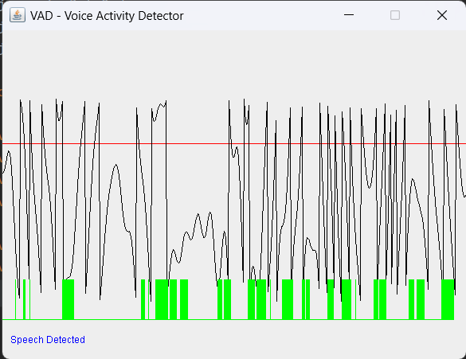

# Voice Activity Visualization Application

## Overview

The **Voice Activity Visualization Application** is an innovative software tool developed by Ashutosh Pandey that allows users to gain insights into real-time microphone voice activity through intuitive graphical representations. This documentation provides a comprehensive guide to understanding, installing, configuring, and using the application effectively.

## Features

### Real-Time Voice Activity Visualization

The application offers a unique real-time voice activity visualization feature. It provides users with a dynamic graphical representation of the audio input, making it easy to monitor and analyze voice activity as it happens.

### User-Friendly Interface

With a user-friendly graphical interface, the application is designed to cater to users of all skill levels. The intuitive design ensures that you can start using the application without a steep learning curve.

### Compatibility with Java 8

The Voice Activity Visualization Application is compatible with Java 8, ensuring broad accessibility across various systems and environments.

### Easy Installation and Usage

Installing and using the application is straightforward. Follow the steps outlined below to get started.

## Installation

### Prerequisites

Before installing the application, ensure that you have the following:

- **Java Runtime Environment (JRE)**: Version 8 or higher.

### Download and Run

1. Visit the [GitHub repository](https://github.com/theashutoshpandey/voice-activity-visualization).
2. Clone the latest release package.

3. After downloading, double-click the JAR file to launch the application. Alternatively, you can run the following command in your terminal:

   ```bash
   java -jar VoiceActivityVisualization.jar
### Output
  
